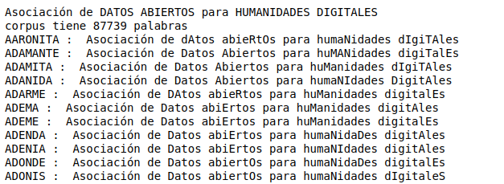

# notebook-acronym
Colección de Jupyter notebooks de demostración para generar acrónimos a partir de un corpus de palabras en español e inglés.

# Acrónimos en español
La versión en español se basa en un corpus de palabras disponible en [GitHub](https://github.com/olea/lemarios/blob/master/lemario-general-del-espanol.txt).   Consulta el notebook [acronimos.ipynb](https://nbviewer.org/github/hibernator11/notebook-acronym/blob/main/acronimos.ipynb).

# Acrónimos en inglés
La versión en inglés permite obtener acrónimos automticamente. Consulta el notebook [acronyms.ipynb](https://nbviewer.org/github/hibernator11/notebook-acronym/blob/main/acronyms.ipynb).

# Referencias
Código desarrollado por la [Biblioteca Virtual Miguel de Cervantes](http://www.cervantesvirtual.com/).
